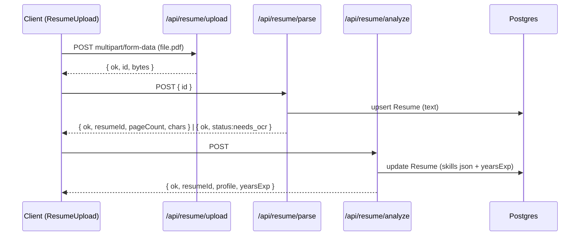
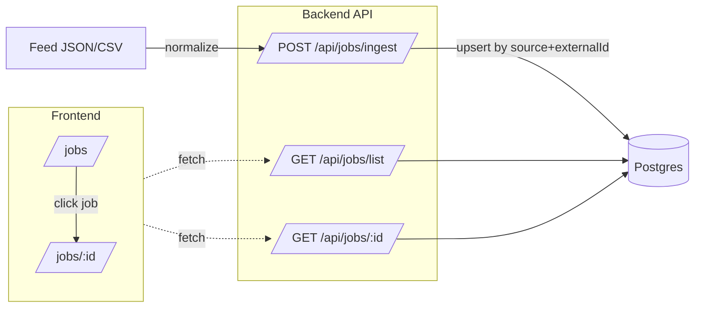
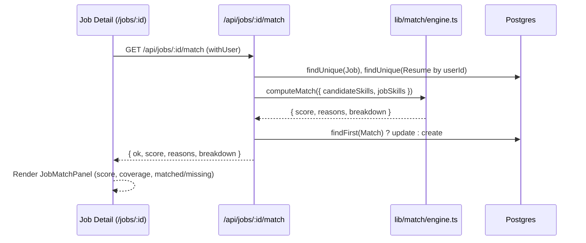

---

# Job AI App — README (Stage 11)

> גרסת README מותאמת ל-GitHub (Markdown + Mermaid).
>
> זרימות מרכזיות:
>
> * **Resume:** Upload → Parse → Analyze
> * **Jobs:** Ingest → List → Detail
> * **Match (Stage 11):** Job Detail → Compute Match → Persist → Show

---

## 🔭 סקירה כללית

האפליקציה מטפלת בשלושה צירים:

1. **קורות חיים (Resume)**
   העלאת PDF → שמירה זמנית (TMP) → חילוץ טקסט (Parse) → ניתוח AI ל-JSON מובנה → שמירה והצגה ב-UI.

2. **משרות (Jobs)**
   Ingest מפיד מדומה עם נורמליזציה ואיחוד שדות → List API עם פילטרים ודפדוף → דף פרטי משרה.

3. **התאמה (Match) — Stage 11**
   חישוב ציון התאמה בסיסי בין סקילז המועמד לדרישות המשרה, שמירה בטבלת `Match`, והצגה ב־UI.

---

## 📈 תרשימי זרימה

### קורות חיים — רצף (Upload → Parse → Analyze)



### משרות — Ingest → List → Detail



### התאמה (Stage 11) — Job Detail → Match



---

## 🧱 סכמת נתונים (Prisma)

### Resume

* `text: String`
* `skills: Json` — יכול להיות מערך (`string[]`) או אובייקט עם `{ skills[], tools[], dbs[] }`
* `yearsExp: Int?`
* `userId: String @unique` — **רשומה אחת לכל משתמש**
* `updatedAt @updatedAt`

### Job

* `source, externalId, title, company, location?, description, url?`
* `skillsRequired: String[]` — **lowercase**
* `createdAt`
* אינדקסים/ייחודיות:

  * `@@unique([source, externalId])`
  * `@@index([createdAt])`

### Match (בשימוש Stage 11)

* `userId: String`, `jobId: String`
* `score: Float`, `reasons: Json` (בפועל `string[]`)
* `createdAt: DateTime @default(now())`

> 💡 **בונוס מומלץ (לא חובה בשלב 11):** הוספת `@@unique([userId, jobId])` למניעת כפילויות ו־`upsert` אטומי.

---

## 🔐 אימות גלובלי

`lib/auth.ts` מספק `authOptions`, `auth()`, `requireUser()`, ו־`withUser(handler)`.

דוגמה (NextAuth API):

```ts
// app/api/auth/[...nextauth]/route.ts
import NextAuth from "next-auth";
import { authOptions } from "@/lib/auth";
const handler = NextAuth(authOptions);
export { handler as GET, handler as POST };
```

> ב־Stage 11, `/api/jobs/:id/match` מוגן ע״י `withUser` (דורש התחברות).
> שאר API המשרות (list/detail) ציבוריים לקריאה.

---

## 🧪 API

### (תזכורת Stage 9–10)

1. `POST /api/resume/upload`
2. `POST /api/resume/parse`
3. `POST /api/resume/analyze`
4. `POST /api/jobs/ingest` *(מוגן)*
5. `GET /api/jobs/list`
6. `GET /api/jobs/:id`

---

### 7) `GET /api/jobs/:id/match`  *(Stage 11)*

**מטרה:** לחשב ציון התאמה בין המועמד לבין משרה, לשמור ל־DB, ולהחזיר תוצאה ל־UI.

* **אבטחה:** מוגן ע״י `withUser` → לא מחובר ⇒ `401`.
* **תלות:** `Resume` של המשתמש עם `skills` ו־`Job.skillsRequired`.

**פלט תקין (200):**

```json
{
  "ok": true,
  "score": 75,
  "reasons": ["התאמה: react, typescript", "חסרים: node"],
  "breakdown": {
    "matched": ["react","typescript"],
    "missing": ["node"],
    "extra": ["postgresql","git"],
    "coverage": 0.67
  }
}
```

**שגיאות:**

* `401 { "error": "unauthorized" }` — לא מחובר (נוצר ע״י withUser).
* `404 { ok:false, error:"JOB_NOT_FOUND" }` — משרה לא קיימת.
* `422 { ok:false, error:"NO_RESUME" }` — אין `Resume` למשתמש.
* `422 { ok:false, error:"NO_CANDIDATE_SKILLS" }` — אין סקילז ב־Resume.

**דוגמאות:**

```bash
# תקין (מחובר)
curl -i "http://localhost:3000/api/jobs/<JOB_ID>/match"

# 404 — מזהה לא קיים
curl -i "http://localhost:3000/api/jobs/does-not-exist/match"

# 422 — אין Resume
# (ניתן לסמלץ ע"י מחיקת הרשומה ב-Prisma Studio)
curl -i "http://localhost:3000/api/jobs/<JOB_ID>/match"
```

> ❗ נפוץ לטעות בין נתיבי דף ל־API:
> **נכון:** `/api/jobs/<id>/match`
> **לא נכון:** `/jobs/<id>/match` (זה דף ולא קיים)

---

## 🧠 מנוע התאמה (Stage 11)

**קובץ:** `lib/match/engine.ts` — פונקציה טהורה ללא IO.

* **קלט:**
  `candidateSkills: string[]`, `jobSkills: string[]`
  (תמיכה עתידית: `candidateYears?`, `jobLocation?`)

* **לוגיקה (v1):**

  * נירמול: lowercase + trim + הסרת כפילויות.
  * אין דרישות במשרה → **score 50**, `coverage = null`.
  * אין סקילז למועמד → **score 0**.
  * אחרת: `coverage = |matched| / |jobSkills|` → `score = round(coverage*100)`.
  * מחזיר גם `reasons` + `breakdown { matched, missing, extra, coverage }`.

* **בדיקות יחידה (smoke):**
  `scripts/test-match.ts`

  ```bash
  npx tsx scripts/test-match.ts
  ```

---

## 🖥️ UI

### Jobs (Stage 10)

* **`/jobs`** — רשימת משרות עם פילטרים (`q/location/skill`) ודפדוף.
* **`/jobs/:id`** — דף פרטי משרה (Server Component): מציג מקור, `externalId`, תיאור, `skillsRequired`, וקישור למקור.

### Match Panel (Stage 11)

* **קומפוננטה:** `components/JobMatchPanel.tsx` *(Client, עם `"use client"`)*

  * בעת הטענה שולחת `GET /api/jobs/:id/match`.
  * מציגה ציון, כיסוי, רשימות matched/missing, ו־reasons.
  * כפתור “רענן” לשמישות מהירה לאחר שינוי קו״ח.

* **חיבור לדף המשרה:** `app/jobs/[id]/page.tsx`
  ייבוא ישיר (ללא `next/dynamic`) — App Router יודע “לתחום” Client Component:

  ```tsx
  import JobMatchPanel from "@/components/JobMatchPanel";
  ...
  <JobMatchPanel jobId={job.id} />
  ```

---

## ⚙️ התקנה והפעלה

דרישות: **Node 18+**, **PostgreSQL**

```bash
npm i
npx prisma migrate dev && npx prisma generate
npm run dev
```

### משתני סביבה

```env
DATABASE_URL=postgres://...
NEXTAUTH_URL=http://localhost:3000
NEXTAUTH_SECRET=...
GITHUB_ID=...
GITHUB_SECRET=...
OPENAI_API_KEY=sk-...   # שרת בלבד
```

> **חשוב:** אל תדחוף `.env/.env.local` לריפו. שמור טמפלייט נקי ב־`.env.local.example`.

---

## 📁 מבנה תיקיות (עיקרי)

```
app/
  api/
    auth/[...nextauth]/route.ts
    resume/
      upload/route.ts
      parse/route.ts
      analyze/route.ts
    jobs/
      ingest/route.ts
      list/route.ts
      [id]/route.ts
      [id]/match/route.ts        # ← Stage 11
  jobs/
    page.tsx
    [id]/page.tsx                # ← כולל <JobMatchPanel jobId={job.id} />

components/
  ResumeUpload.tsx
  JobsFilters.tsx
  JobMatchPanel.tsx              # ← Stage 11 (Client)

lib/
  auth.ts
  db.ts
  jobs/
    ...                          # נורמליזציה ל-ingest
  match/
    engine.ts                    # ← Stage 11

scripts/
  test-match.ts                  # ← Stage 11 (בדיקות מנוע)

data/
  jobs-feed.json

prisma/
  schema.prisma
  migrations/
```

---

## 🧰 תקלות ופתרונות מהירים

* **פתחתי `/jobs/:id/match` וקיבלתי 404**
  זה נתיב דף. ה־API נמצא ב־`/api/jobs/:id/match`.

* **ב־`/jobs/:id` קיבלתי שגיאת dynamic/SSR**
  אל תשתמש ב־`next/dynamic({ ssr:false })` ב־Server Component.
  יבוא ישיר של Client Component מספיק.

* **401 ב־`/api/jobs/:id/match`**
  זה הגיוני — הנתיב מוגן עם `withUser`. התחבר דרך GitHub.

* **422 `NO_RESUME`/`NO_CANDIDATE_SKILLS`**
  ודא שיש רשומת `Resume` וש־`skills` לא ריק (רץ `Analyze` או עדכן ב-Prisma Studio).

* **Match לא מתעדכן**
  בדוק ב־Prisma Studio. ב־Stage 11 אנו עושים `findFirst→update/create`.
  לביטחון אטומי מול מרוצים — הוסף `@@unique([userId, jobId])` ועבור ל־`upsert`.

---

## ✅ צ’קליסט Stage 11

* [x] **Engine (V1):** `lib/match/engine.ts` — חישוב לפי כיסוי סקילז + `reasons`/`breakdown`
* [x] **API:** `GET /api/jobs/:id/match` (מוגן `withUser`) — שליפת Job+Resume, חישוב, Persist ל־`Match`
* [x] **UI:** `JobMatchPanel` (Client) + שילוב ב־`/jobs/:id`
* [x] **בדיקות:**

  * מנוע: `npx tsx scripts/test-match.ts`
  * ידניות: 200/401/404/422 + בדיקת עדכון ב־Prisma Studio
* [x] **Git:** קומיט מסכם (ללא `.env`)

---

## 🔜 המשך דרך

* **Stage 11.1:** משקולים לניסיון (`candidateYears`) ולמיקום (`jobLocation`) במשקל כולל.
* **DB יציבות:** הוסף `@@unique([userId, jobId])` ל־`Match` והחלף ל־`upsert`.
* **UI רשימות:** פילטר “הצג ≥ 70” בעמוד `/jobs`.
* OCR ל-PDF סרוקים, Queue/Worker ל-PDF כבדים, Ajv Validation ל-Schemas, דשבורד פרופיל.

---

**License:** MIT
**Author:** itay — Job AI App
