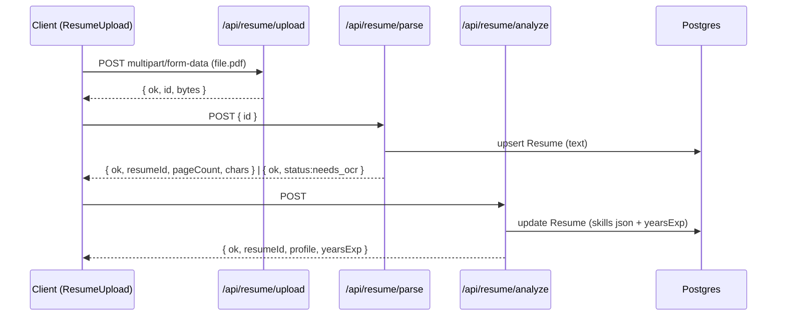
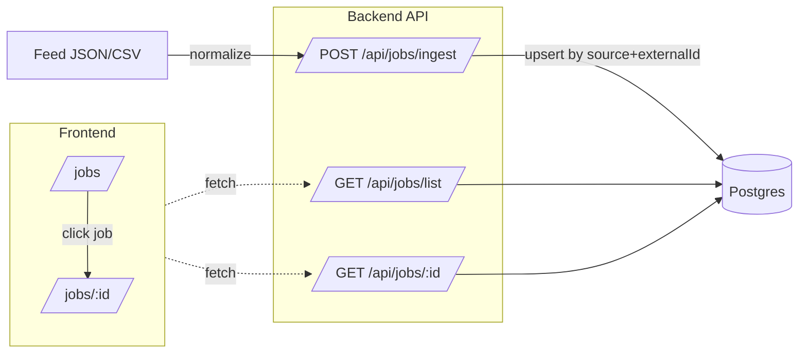
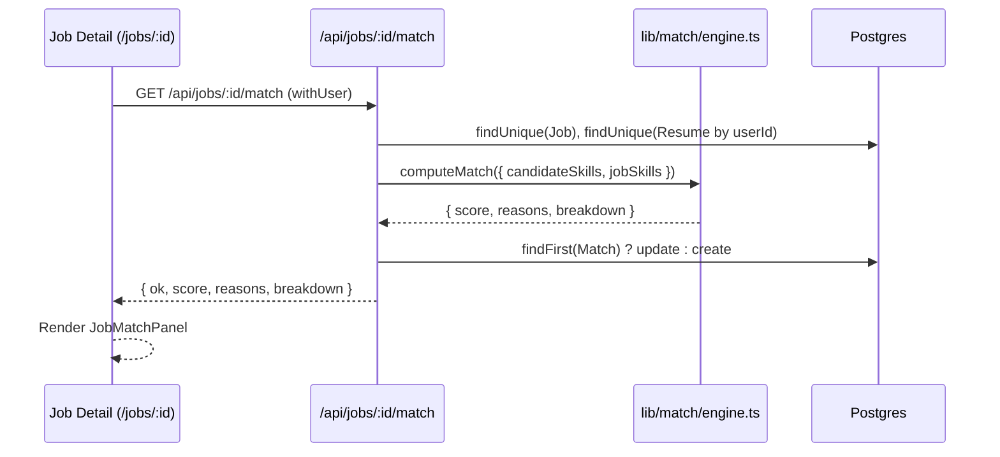
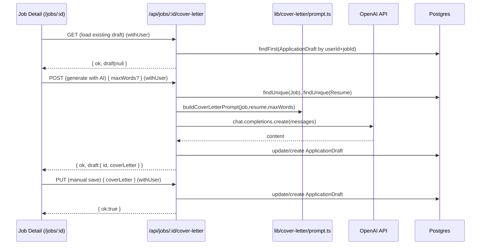

להלן **README מעודכן ל–Stage 12** (מוכן להדבקה ב-GitHub: Markdown + Mermaid).

---

# Job AI App — README (Stage 12)

> גרסת README מותאמת ל-GitHub (Markdown + Mermaid).
>
> זרימות מרכזיות:
>
> * **Resume:** Upload → Parse → Analyze
> * **Jobs:** Ingest → List → Detail
> * **Match (Stage 11):** Job Detail → Compute Match → Persist → Show
> * **Cover Letter (Stage 12):** Job Detail → Generate (AI) / Edit → Save Draft

---

## 🔭 סקירה כללית

האפליקציה מטפלת בשלושה צירים עיקריים + כתיבת מכתב פנייה:

1. **קורות חיים (Resume)**
   העלאת PDF → שמירה זמנית (TMP) → חילוץ טקסט (Parse) → ניתוח AI ל-JSON מובנה → שמירה והצגה ב-UI.

2. **משרות (Jobs)**
   Ingest מפיד מדומה עם נורמליזציה ואיחוד שדות → List API עם פילטרים ודפדוף → דף פרטי משרה.

3. **התאמה (Match) — Stage 11**
   חישוב ציון התאמה בסיסי בין סקילז המועמד לדרישות המשרה, שמירה בטבלת `Match`, והצגה ב־UI.

4. **מכתב פנייה (Cover Letter) — Stage 12**
   פרומפט אחיד ל-AI (טון ענייני, מגבלת מילים, הזרקת פרויקטים/Highlights), יצירה/עריכה/שמירה כ-Draft בטבלת `ApplicationDraft`, UI לעריכה ושמירה.

---

## 📈 תרשימי זרימה

### קורות חיים — רצף (Upload → Parse → Analyze)



### משרות — Ingest → List → Detail



### התאמה (Stage 11) — Job Detail → Match



### מכתב פנייה (Stage 12) — Generate / Edit / Save



---

## 🧱 סכמת נתונים (Prisma)

### Resume

* `text: String`
* `skills: Json` — יכול להיות מערך (`string[]`) או אובייקט עם `{ skills[], tools[], dbs[], highlights[]? }`
* `yearsExp: Int?`
* `userId: String @unique` — **רשומה אחת לכל משתמש**
* `updatedAt @updatedAt`

### Job

* `source, externalId, title, company, location?, description, url?`
* `skillsRequired: String[]` — **lowercase**
* `createdAt`
* אינדקסים/ייחודיות:

  * `@@unique([source, externalId])`
  * `@@index([createdAt])`

### Match (Stage 11)

* `userId: String`, `jobId: String`
* `score: Float`, `reasons: Json` (בפועל `string[]`)
* `createdAt: DateTime @default(now())`

### ApplicationDraft (Stage 12)

* `userId: String`, `jobId: String`
* `coverLetter: String`
* `createdAt`, `updatedAt`

> 💡 **בונוס מומלץ:** הוסף `@@unique([userId, jobId])` ל-`ApplicationDraft` ועבור ל-`upsert` אטומי.

---

## 🔐 אימות גלובלי

`lib/auth.ts` מספק `authOptions`, `auth()`, `requireUser()`, ו־`withUser(handler)`.

דוגמה (NextAuth API):

```ts
// app/api/auth/[...nextauth]/route.ts
import NextAuth from "next-auth";
import { authOptions } from "@/lib/auth";
const handler = NextAuth(authOptions);
export { handler as GET, handler as POST };
```

> נתיבי Stage 12 (`/api/jobs/:id/cover-letter`) מוגנים ע״י `withUser` (דורש התחברות).

---

## 🧪 API

### תזכורת Stage 9–11

1. `POST /api/resume/upload`
2. `POST /api/resume/parse`
3. `POST /api/resume/analyze`
4. `POST /api/jobs/ingest` *(מוגן)*
5. `GET /api/jobs/list`
6. `GET /api/jobs/:id`
7. `GET /api/jobs/:id/match` *(Stage 11)*

---

### 8) `GET /api/jobs/:id/cover-letter` *(Stage 12)*

**מטרה:** שליפת טיוטת מכתב קיימת (אם יש) עבור המשתמש המחובר.
**אבטחה:** `withUser` → 401 אם לא מחובר.
**שגיאות:** 404 `JOB_NOT_FOUND`.

**פלט:**

```json
{ "ok": true, "draft": null }
```

או

```json
{ "ok": true, "draft": { "id": "…", "coverLetter": "…", "updatedAt": "…" } }
```

### 9) `POST /api/jobs/:id/cover-letter` *(Stage 12)*

**מטרה:** יצירת מכתב בעזרת AI ושמירתו כ-Draft.
**קלט (אופציונלי):**

```json
{ "maxWords": 220 }  // טווח 80..400, ברירת מחדל 220
```

**תהליך:** טוען Job+Resume → בונה פרומפט → OpenAI (`gpt-4o-mini`) → בדיקת מגבלת מילים → persist (`ApplicationDraft`).
**שגיאות:**

* 401 (לא מחובר), 404 (`JOB_NOT_FOUND`),
* 422 (`NO_RESUME` / `OVER_WORD_LIMIT`),
* 500 (`MISSING_OPENAI_KEY` / `EMPTY_COMPLETION`).

**פלט תקין:**

```json
{ "ok": true, "draft": { "id": "…", "coverLetter": "…", "maxWords": 220 } }
```

### 10) `PUT /api/jobs/:id/cover-letter` *(Stage 12)*

**מטרה:** עדכון ידני של הטקסט ושמירה כ-Draft.
**קלט:**

```json
{ "coverLetter": "טקסט מעודכן..." }
```

**ולידציה:** תוכן לא ריק; תקרת בטיחות 400 מילים.
**שגיאות:** 401, 404 `JOB_NOT_FOUND`, 422 `EMPTY_CONTENT`/`OVER_WORD_LIMIT`.
**פלט:**

```json
{ "ok": true, "draft": { "id": "…" } }
```

**דוגמאות curl (תקין):**

```bash
# GET draft
curl "http://localhost:3000/api/jobs/<JOB_ID>/cover-letter"

# POST generate
curl -X POST -H "Content-Type: application/json" \
  -d '{"maxWords":220}' \
  "http://localhost:3000/api/jobs/<JOB_ID>/cover-letter"

# PUT save
curl -X PUT -H "Content-Type: application/json" \
  -d '{"coverLetter":"Short edited paragraph..."}' \
  "http://localhost:3000/api/jobs/<JOB_ID>/cover-letter"
```

> ❗ שים לב לנתיב: זה **API** ב־`/api/jobs/<id>/cover-letter` (לא דף `/jobs/<id>/cover-letter`).

---

## 🧠 ספריית פרומפטים (Stage 12)

**קובץ:** `lib/cover-letter/prompt.ts`

* `extractResumeProfile(skillsJson)` — תומך במערך או אובייקט `{ skills, tools, dbs, highlights? }`.
* `detectLanguageFromJob(job)` — זיהוי אוטומטי: עברית אם קיימים תווי עברית בתיאור, אחרת אנגלית.
* `buildCoverLetterPrompt({ job, resume, maxWords, language? })` — מחזיר `{ messages, language, maxWords }`:

  * טון ענייני ומקצועי, ללא “פלף”.
  * מגבלת מילים קשיחה 80–400 (ברירת מחדל 220).
  * שילוב 2–3 סקילז רלוונטיים, ו-Highlight אם קיים.

**בדיקות Smoke:** `scripts/test-cover-prompt.ts`

```bash
npx tsx scripts/test-cover-prompt.ts
```

---

## 🖥️ UI

### Match Panel (Stage 11)

* `components/JobMatchPanel.tsx` (Client) — מציג ציון התאמה ו-breakdown.

### Cover Letter Editor (Stage 12)

* **קומפוננטה:** `components/CoverLetterEditor.tsx` *(Client, עם `"use client"`)*

  * טוען טיוטה (`GET`), מייצר (`POST`), שומר (`PUT`).
  * מונה מילים + מגבלת מילים (ברירת מחדל 220).
  * הודעות שגיאה/מצב ידידותיות.

* **שילוב בעמוד המשרה:** `app/jobs/[id]/page.tsx`

  ```tsx
  import JobMatchPanel from "@/components/JobMatchPanel";
  import CoverLetterEditor from "@/components/CoverLetterEditor";

  // ...
  <JobMatchPanel jobId={job.id} />
  <CoverLetterEditor jobId={job.id} maxWords={220} />
  ```

> אין להשתמש ב-`next/dynamic({ ssr:false })` בתוך Server Component. ייבוא ישיר של קומפוננטת Client מספיק — App Router יוצר גבול אוטומטי.

---

## ⚙️ התקנה והפעלה

דרישות: **Node 18+**, **PostgreSQL**

```bash
npm i
npx prisma migrate dev && npx prisma generate
npm run dev
```

### משתני סביבה

```env
DATABASE_URL=postgres://...
NEXTAUTH_URL=http://localhost:3000
NEXTAUTH_SECRET=...
GITHUB_ID=...
GITHUB_SECRET=...
OPENAI_API_KEY=sk-...   # נדרש ל-POST cover-letter (שרת בלבד)
```

> **חשוב:** אל תדחוף `.env/.env.local` לריפו. שמור טמפלייט נקי ב־`.env.local.example`.

---

## 📁 מבנה תיקיות (עיקרי)

```
app/
  api/
    auth/[...nextauth]/route.ts
    resume/
      upload/route.ts
      parse/route.ts
      analyze/route.ts
    jobs/
      ingest/route.ts
      list/route.ts
      [id]/route.ts
      [id]/match/route.ts               # Stage 11
      [id]/cover-letter/route.ts        # Stage 12 (GET/POST/PUT)
  jobs/
    page.tsx
    [id]/page.tsx                       # כולל <JobMatchPanel /> ו-<CoverLetterEditor />

components/
  ResumeUpload.tsx
  JobsFilters.tsx
  JobMatchPanel.tsx                     # Stage 11
  CoverLetterEditor.tsx                 # Stage 12

lib/
  auth.ts
  db.ts
  jobs/
    ...                                 # נורמליזציה ל-ingest
  match/
    engine.ts                           # Stage 11
  cover-letter/
    prompt.ts                           # Stage 12

scripts/
  test-match.ts                         # Stage 11
  test-cover-prompt.ts                  # Stage 12

data/
  jobs-feed.json

prisma/
  schema.prisma
  migrations/
```

---

## 🧰 תקלות ופתרונות מהירים

* **401 על cover-letter** — הנתיבים מוגנים ב־`withUser`; התחבר (GitHub).
* **404 `JOB_NOT_FOUND`** — ודא שה-`JOB_ID` קיים (בדוק דרך `/api/jobs/list`).
* **422 `NO_RESUME`** — אין רשומת Resume; הרץ Analyze או צור ידנית ב-Studio.
* **422 `OVER_WORD_LIMIT`** — המודל/המשתמש חרג ממגבלת מילים (POST/PUT). קצץ ושמור שוב.
* **שגיאת dynamic/SSR בעמוד משרה** — אל תייבא `next/dynamic({ ssr:false })` ב-Server Component.
* **Draft לא מתעדכן** — בדוק ב-Prisma Studio. לשיפור אטומיות: הוסף `@@unique([userId, jobId])` ועבור ל-`upsert`.

---

## ✅ צ’קליסט Stage 12

* [x] **ספריית פרומפטים:** `lib/cover-letter/prompt.ts` + בדיקות smoke.
* [x] **API:**

  * `GET /api/jobs/:id/cover-letter` — שליפת טיוטה קיימת.
  * `POST /api/jobs/:id/cover-letter` — יצירה עם AI + שמירה כ-Draft.
  * `PUT /api/jobs/:id/cover-letter` — עדכון ידני ושמירה.
* [x] **UI:** `CoverLetterEditor` + שילוב ב-`/jobs/:id`.
* [x] **בדיקות:** 200/401/404/422/500, וידוא Persist ב-Prisma Studio.
* [x] **Git:** קומיטים ללא `.env`.

---

## 🔜 המשך דרך

* **DB יציבות:** `@@unique([userId, jobId])` ל-`ApplicationDraft` + מעבר ל-`upsert`.
* **UX:** שמירה אוטומטית (debounce), Toasts, הדגשת מילות מפתח מהמשרה בטקסט.
* **בקרת טון/שפה:** פרופילים (ענייני/פורמלי/חם) + בחירת שפה ידנית מה-UI.
* **היסטוריית גרסאות:** שמירת snapshot-ים של טיוטות.
* **אינטגרציה:** הורדה כ-PDF/Markdown, שליחה ישירה לפורטל (בעתיד).

---

**License:** MIT
**Author:** itay — Job AI App
