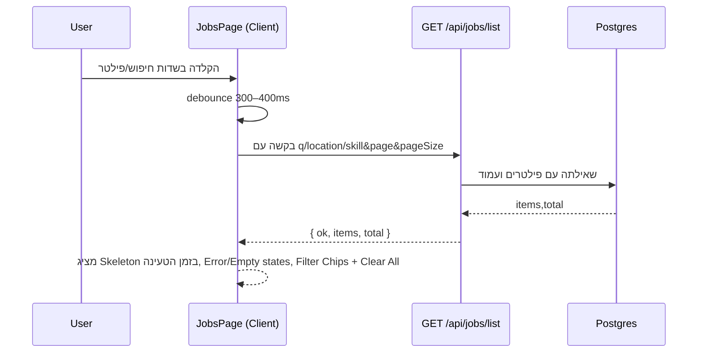
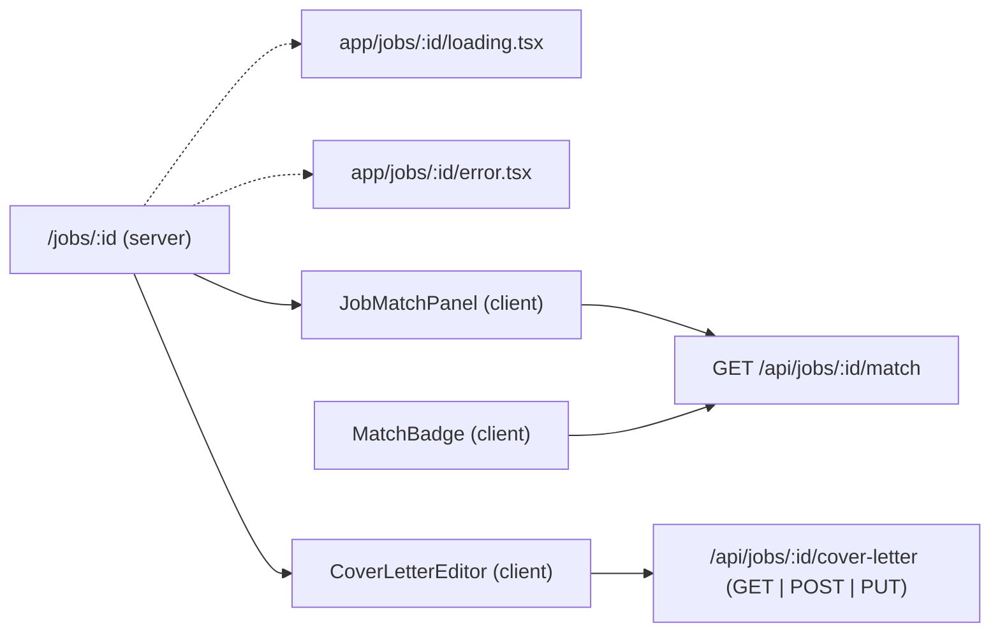

להלן **README מעודכן ל–Stage 13** (מוכן להדבקה ב-GitHub: Markdown + Mermaid).

---

# Job AI App — README (Stage 13)

> גרסת README מותאמת ל-GitHub (Markdown + Mermaid).
>
> זרימות מרכזיות:
>
> * **Resume:** Upload → Parse → Analyze
> * **Jobs:** Ingest → List → Detail
> * **Match (Stage 11):** Job Detail → Compute Match → Persist → Show
> * **Cover Letter (Stage 12):** Job Detail → Generate (AI) / Edit → Save Draft
> * **UI/UX Polish (Stage 13):** Loading/Skeletons, Filter Chips + Clear All, Debounced Search, Match Badge, Navbar Menu, Resume Upload UX

---

## 🔭 סקירה כללית

האפליקציה כוללת שלושה צירים עיקריים + מכתב פנייה, וב-Stage 13 הוספנו **ליטוש חוויית משתמש**:

* **מצבי טעינה** עם `Skeleton` ברכיבים מרכזיים (Jobs, Resume Upload, Match).
* **חיפוש עשיר** בעמוד Jobs:

  * סינון בזמן הקלדה (Debounce)
  * **Filter Chips** עם אפשרות **Clear All**
  * Empty/Error states ברורים
* **Match Badge** קומפוננטת לקוח “קלילה” להצגת ציון התאם מיידי ברשימה.
* **Navbar מודע אימות**: אווטאר + תפריט `<details>` (נגיש), מצב טעינה.
* **Resume Upload משודרג**: Dropzone נגיש, Stepper לשלבים, Skeleton בזמן Analyze, הודעות 401 עם CTA להתחברות.

> שים לב: Stage 13 ממוקד ב-UI/UX — ה-API/DB לא השתנו פונקציונלית בשלב זה.

---

## 📈 תרשימי זרימה

### Jobs — חיפוש עם Debounce + Chips + Loading



### Job Detail — Match + Cover Letter + Route Loading/Error



---

## 🧱 סכמת נתונים (Prisma)

**אין שינויי סכימה ב-Stage 13.** (נשאר כמו Stage 12)

* `Resume`, `Job`, `Match`, `ApplicationDraft` — ללא עדכונים בשלב זה.

---

## 🔐 אימות

* ממשיך להשתמש ב-`lib/auth.ts` (`withUser`) עבור נתיבי Match/Cover Letter.
* Navbar מציג **Skeleton** בזמן `status === "loading"`, **Sign in** כשלא מחובר, **אווטאר + תפריט** כשמחובר.

---

## 🧪 API (ללא שינוי מ-Stage 12)

1. `POST /api/resume/upload`
2. `POST /api/resume/parse`
3. `POST /api/resume/analyze`
4. `POST /api/jobs/ingest` *(מוגן)*
5. `GET /api/jobs/list`
6. `GET /api/jobs/:id`
7. `GET /api/jobs/:id/match`
8. `GET /api/jobs/:id/cover-letter`
9. `POST /api/jobs/:id/cover-letter`
10. `PUT /api/jobs/:id/cover-letter`

---

## 🖥️ UI — מה חדש ב-Stage 13

### 1) Jobs List (פונקציונליות חדשה)

* **Debounced search** בזמן הקלדה (ללא צורך בלחיצה על “סנן”).
* **Filter Chips** מתחת לטופס — אפשר להסיר כל פילטר ע״י X או **Clear All**.
* **Loading Skeleton** בזמן בקשה.
* **Empty/Error states** נעימים וברורים.
* (אופציונלי) **MatchBadge** ליד כל Job, המציג ציון התאמה בזמן אמת (Lazy).

קבצים נוגעים:

* `app/jobs/page.tsx` — קריאות API עם Debounce, ניהול טעינה/שגיאה.
* `components/JobsFilters.tsx` — טריגר onChange בזמן הקלדה.
* `components/FilterChips.tsx` — ניהול תגיות פילטר ו-Clear All.
* `components/EmptyState.tsx`, `components/ErrorState.tsx` — תצוגות ריקות/שגיאה.
* `components/MatchBadge.tsx` — בקשה ל-`/api/jobs/:id/match` קלילה לפריט.

### 2) Job Detail

* **Route loading/error**:
  `app/jobs/[id]/loading.tsx`, `app/jobs/[id]/error.tsx`
  → שליטה מלאה בטעינה/שגיאה במסך פרטי משרה.
* ממשיך לכלול: `JobMatchPanel` + `CoverLetterEditor`.

### 3) Navbar

* מצבי אימות: `loading` → Skeleton, `unauthenticated` → Sign in, `authenticated` → אווטאר + תפריט `<details>` (נגיש).

קובץ: `components/Navbar.tsx`.

### 4) Resume Upload — UX

* **Dropzone** נגיש (גרירה/לחיצה/Enter/Space), תגית קובץ עם מחיקה.
* **Stepper** לשלבים: Upload → Parse → Analyze.
* **Skeleton** בזמן Analyze.
* הודעות 401 עם כפתור התחברות.

קובץ: `components/ResumeUpload.tsx`.

---

## ⚙️ התקנה והפעלה

דרישות: **Node 18+**, **PostgreSQL**

```bash
npm i
npx prisma migrate dev && npx prisma generate
npm run dev
```

### משתני סביבה

```env
DATABASE_URL=postgres://...
NEXTAUTH_URL=http://localhost:3000
NEXTAUTH_SECRET=...
GITHUB_ID=...
GITHUB_SECRET=...
OPENAI_API_KEY=sk-...   # נדרש ל-POST cover-letter (שרת בלבד)
```

> **חשוב:** אל תדחוף `.env/.env.local` לריפו. החזק טמפלייט נקי ב־`.env.local.example`.

---

## 📁 מבנה תיקיות (מעודכן)

```
app/
  api/
    auth/[...nextauth]/route.ts
    resume/
      upload/route.ts
      parse/route.ts
      analyze/route.ts
    jobs/
      ingest/route.ts
      list/route.ts
      [id]/route.ts
      [id]/match/route.ts
      [id]/cover-letter/route.ts
  jobs/
    page.tsx
    [id]/
      page.tsx
      loading.tsx                 # Stage 13
      error.tsx                   # Stage 13

components/
  ui/
    button.tsx
    skeleton.tsx                  # Stage 13
  Navbar.tsx                      # Stage 13 (auth-aware)
  ResumeUpload.tsx                # Stage 13 (dropzone/stepper)
  JobsFilters.tsx                 # Stage 13 (debounced)
  FilterChips.tsx                 # Stage 13
  EmptyState.tsx                  # Stage 13
  ErrorState.tsx                  # Stage 13
  JobMatchPanel.tsx
  MatchBadge.tsx                  # Stage 13
  CoverLetterEditor.tsx

lib/
  auth.ts
  db.ts
  jobs/
    ...
  match/
    engine.ts
  cover-letter/
    prompt.ts

hooks/
  useDebouncedValue.ts            # Stage 13 (אם בשימוש)

scripts/
  test-match.ts
  test-cover-prompt.ts

data/
  jobs-feed.json

prisma/
  schema.prisma
  migrations/
```

---

## 🧰 תקלות ופתרונות מהירים

* **Skeleton לא מוצג** → ודא `components/ui/skeleton.tsx` קיים ומיובא נכון.
* **Debounce לא עובד** → בדוק את ה-hook (`useDebouncedValue`) או את הקריאות ב-`useEffect` בהתאם ל-query.
* **MatchBadge טעות טיפוס Ref** → ודא שלא מועבר `ref` של `<span>` ל-`Button`; עטוף את התוכן במקום, או העבר `ref` ל-`button`.
* **Route Loading/Error לא נתפסים** → הקפד על השמות המדויקים `loading.tsx` / `error.tsx` בתיקיית הסגמנט `[id]`.
* **401 ב-Match/Cover Letter** → התחבר (GitHub). הנתיבים מוגנים עם `withUser`.
* **שגיאת dynamic/SSR** → אל תשתמש ב-`next/dynamic({ ssr:false })` בתוך Server Component; יבוא ישיר של Client Component מספיק.

---

## ✅ צ’קליסט Stage 13

* [x] **Loading/Skeletons**: Jobs list, Resume Upload (Analyze), Match Panel/Badge
* [x] **Debounced filters** ב-Jobs + **Filter Chips** + **Clear All**
* [x] **Empty/Error states** נעימים
* [x] **MatchBadge** קליל ברשימת המשרות
* [x] **Navbar** מודע אימות: Skeleton/Sign in/Avatar Menu
* [x] **Resume Upload** Dropzone + Stepper + 401 CTA
* [x] **Route loading/error** ל-`/jobs/[id]`
* [x] קומיטים נקיים (ללא `.env`)

---

## 🔜 המשך דרך

* **Stage 14** (אופציונלי): Toasts אחידים, שמירה אוטומטית (debounce) לטיוטות, שיפורי פרפורמנס (Cache/Prefetch), ו-“Score filter ≥ 70” ברשימת Jobs.
* **DB יציבות**: `@@unique([userId, jobId])` ל-`Match`/`ApplicationDraft` + מעבר ל-`upsert`.
* **RTL מלא**: מעבר מסודר ל-RTL אם יוחלט, יחד עם טסטים וסקירה ויזואלית.

---

**License:** MIT
**Author:** itay — Job AI App
