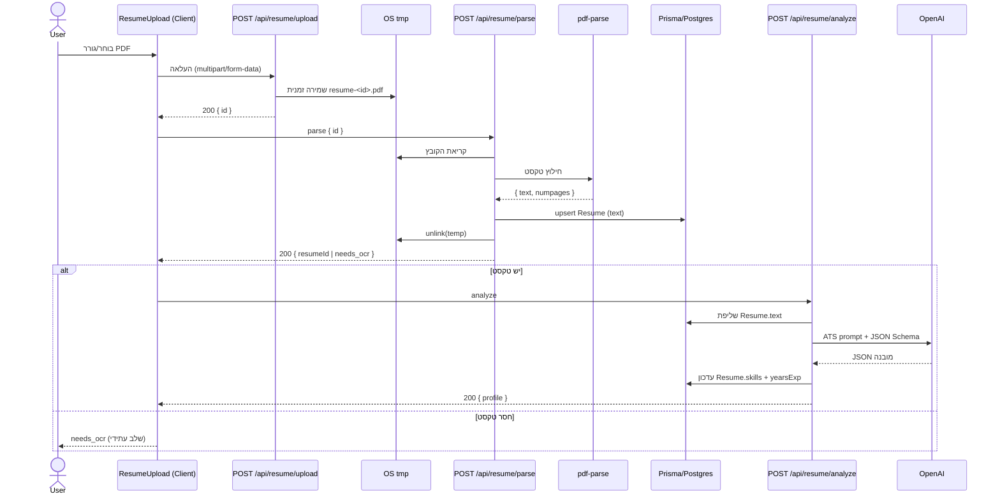
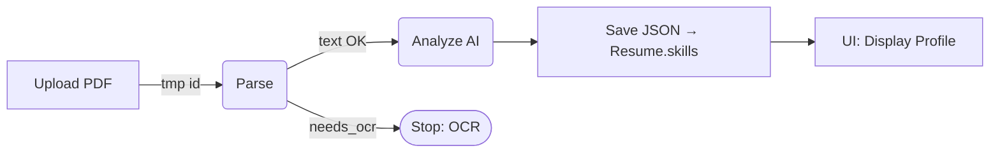

# Job AI App — README (Stage 9, Visual)

> **מטרת המסמך:** גרסת README מותאמת ל‑GitHub (Markdown + Mermaid) שמציגה חזותית את הזרימה Upload → Parse → Analyze, מפרטת API, הגדרות, ותיקיות.
>
> **טיפ:** GitHub מציג תרשימי **Mermaid** אוטומטית. אם פלטפורמה אחרת לא תומכת—אפשר להחליף ל‑PNG/ASCII.

---

## 🔭 סקירה כללית

האפליקציה מבצעת:

1. העלאת PDF של קו״ח → שמירה זמנית (TMP)
2. Parsing (חילוץ טקסט) → שמירה ל‑DB (Prisma/Postgres)
3. **ניתוח AI** (Structured JSON: skills/tools/dbs/years/highlights) → שמירה ל‑DB והצגה ב‑UI

### תרשים רצף (Sequence)



### תרשים זרימה (Flow)



---

## 🧱 סכמת נתונים (Prisma)

**Resume**:

* `text: String` — טקסט מלא מה‑PDF
* `skills: Json` — **האובייקט המובנה** מה‑AI `{ skills[], tools[], dbs[], years, highlights[] }`
* `yearsExp: Int?` — עיגול של `years`
* `userId: String @unique` — רשומה אחת לכל משתמש
* `updatedAt @updatedAt`

שאר מודלי NextAuth: `User/Account/Session/VerificationToken`. מודלי מערכת נוספים: `Job`, `Match`, `ApplicationDraft`.

---

## 🔐 אימות גלובלי

* `lib/auth.ts` מספק `authOptions`, `auth()`, `requireUser()` ו‑`withUser(handler)`
* ראוטים משתמשים ב‑`withUser` כדי לקבל `ctx.user` ו‑401 אוטומטי

```ts
// app/api/auth/[...nextauth]/route.ts
import NextAuth from "next-auth";
import { authOptions } from "@/lib/auth";
const handler = NextAuth(authOptions);
export { handler as GET, handler as POST };
```

---

## 🧪 API

### 1) `POST /api/resume/upload`

* קלט: `multipart/form-data` → שדה `file` (PDF ≤ 5MB)
* ולידציה: סיומת `.pdf`, חתימת `%PDF`
* פעולה: שמירה זמנית ל‑TMP (`resume-<id>.pdf`)
* פלט: `200 { ok, id, bytes }`

**cURL**

```bash
curl -X POST \
  -F "file=@/path/to/resume.pdf;type=application/pdf" \
  http://localhost:3000/api/resume/upload
```

### 2) `POST /api/resume/parse`

* קלט: JSON `{ id }`
* פעולה: קריאת PDF זמני → `pdf-parse` → שמירה ל‑DB (`upsert` by userId)
* פלט:

  * `200 { ok, resumeId, pageCount, chars }`
  * או `200 { ok, id, status:"needs_ocr", pageCount }`

**cURL**

```bash
curl -X POST -H "Content-Type: application/json" \
  -d '{"id":"<tmp-id>"}' http://localhost:3000/api/resume/parse
```

### 3) `POST /api/resume/analyze`

* קלט: ללא גוף (מבוסס על `Resume.text` של המשתמש)
* פעולה: קריאה ל‑OpenAI עם **JSON Schema strict**
* פלט: `200 { ok, resumeId, profile, yearsExp }`

**דוגמת פלט מפושט**

```json
{
  "profile": {
    "skills": ["typescript","react","next.js"],
    "tools": ["git","docker"],
    "dbs": ["postgres","mongodb"],
    "years": 2.5,
    "highlights": ["built full‑stack features", "optimized queries"]
  }
}
```

---

## 🖥️ UI — `components/ResumeUpload.tsx`

* שלבים: `uploading → parsing → analyzing → done/error`
* **אוטומציה מלאה**: לאחר Upload קורא ל‑Parse; אם תקין—ממשיך ל‑Analyze; מציג את הפרופיל המובנה

---

## ⚙️ התקנה והפעלה

```bash
# דרישות: Node 18+, PostgreSQL
npm i
npx prisma migrate dev && npx prisma generate
npm run dev
```

### משתני סביבה

* `DATABASE_URL=postgres://...`
* `NEXTAUTH_URL=http://localhost:3000`
* `NEXTAUTH_SECRET=...`
* `GITHUB_ID=...` / `GITHUB_SECRET=...`
* `OPENAI_API_KEY=sk-...` *(שרת בלבד)*

> אל תקמֵט `.env`/`.env.local` לריפו. שמור טמפלייט נקי ב‑`.env.local.example`.

---

## 📁 מבנה תיקיות

```
app/
  api/
    auth/[...nextauth]/route.ts
    resume/
      upload/route.ts
      parse/route.ts
      analyze/route.ts
  resume/page.tsx
components/
  ResumeUpload.tsx
lib/
  auth.ts
  db.ts
prisma/
  schema.prisma
  migrations/
types/
  pdf-parse.d.ts
```

---

## 🧰 תקלות ופתרונות מהירים

* **ENOENT מ‑pdf-parse** → לייבא מה‑subpath: `pdf-parse/lib/pdf-parse.js`
* **אין שכבת טקסט** → `needs_ocr` (שלב OCR עתידי)
* **401 ב‑API** → ודא התחברות; הראוטים עטופים ב‑`withUser`
* **Missing OPENAI\_API\_KEY** → בדוק `.env` והפעל מחדש dev server

---

## 🔜 המשך דרך

* OCR ל‑PDF סרוקים (Tesseract/Cloud Vision)
* Queue/Worker ל‑PDF כבדים
* Ajv Validation ל‑Schema בצד שרת
* דשבורד להצגת פרופיל ושיפור הפרומפט

---

**License:** MIT
**Author:** itay — Job AI App
