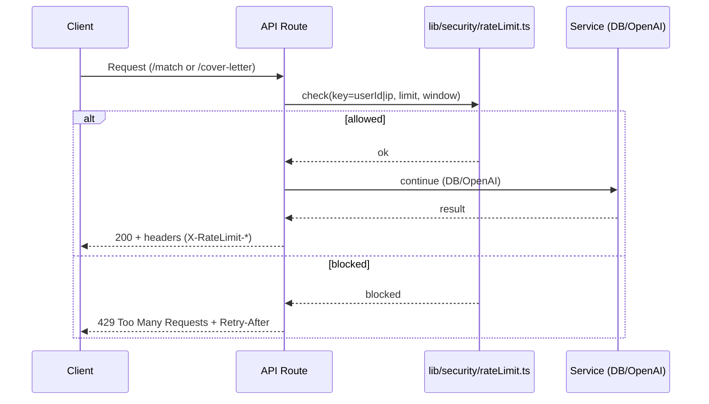
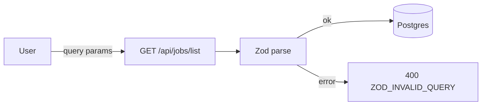

להלן **README מעודכן ל–Stage 14** (מוכן להדבקה ב-GitHub: Markdown + Mermaid).

---

# Job AI App — README (Stage 14)

> גרסת README מותאמת ל-GitHub (Markdown + Mermaid).
>
> זרימות מרכזיות:
>
> * **Resume:** Upload → Parse → Analyze
> * **Jobs:** Ingest → List → Detail
> * **Match (Stage 11):** Job Detail → Compute Match → Persist → Show
> * **Cover Letter (Stage 12):** Job Detail → Generate (AI) / Edit → Save Draft
> * **UI/UX Polish (Stage 13):** Loading/Skeletons, Filter Chips + Clear All, Debounced Search, Match Badge, Navbar Menu, Resume Upload UX
> * **Security (Stage 14):** Rate limiting, Zod validation, AuthN review

---

## 🔭 סקירה כללית

בנוסף לפיצ’רים משלב 13, ב-**Stage 14** חיזקנו את שכבת האבטחה:

* **Rate Limiting** לנתיבים כבדים/רגישים:

  * `GET /api/jobs/:id/match`
  * `GET/POST/PUT /api/jobs/:id/cover-letter`
* **ולידציה עם Zod** לפרמטרים/גוף בקשות:

  * `GET /api/jobs/list` (query)
  * `POST/PUT /api/jobs/:id/cover-letter` (body)
* **ביקורת AuthN/AuthZ**: ודאנו שכל ה-API-ים הרגישים מוגנים ב-`withUser` וששאילתות מסננות לפי `userId`.

> 💡 **מונחים**:
> **AuthN (Authentication)** — אימות זהות (מי אתה).
> **AuthZ (Authorization)** — הרשאה לפעולה/משאב (מה מותר לך).

---

## 📈 תרשימי זרימה

### Rate Limit ב-Match/Cover Letter



### ולידציה עם Zod (דוגמה: `/api/jobs/list`)



---

## 🧱 סכמת נתונים (Prisma)

**אין שינויי סכימה ב-Stage 14**. (כמו Stage 12–13)

* `Resume`, `Job`, `Match`, `ApplicationDraft` — ללא עדכון במודל.

---

## 🔐 אימות והרשאות

* `withUser` ממשיך להגן על:

  * `POST /api/jobs/ingest`
  * `POST /api/resume/upload`
  * `POST /api/resume/parse`
  * `POST /api/resume/analyze`
  * `GET /api/jobs/:id/match`
  * `GET/POST/PUT /api/jobs/:id/cover-letter`
* ציבורי:

  * `GET /api/jobs/list`
  * `GET /api/jobs/:id`

---

## 🧪 API

### (תזכורת Stage 9–13)

1. `POST /api/resume/upload` *(מוגן)*
2. `POST /api/resume/parse` *(מוגן)*
3. `POST /api/resume/analyze` *(מוגן)*
4. `POST /api/jobs/ingest` *(מוגן)*
5. `GET /api/jobs/list` *(ציבורי)*
6. `GET /api/jobs/:id` *(ציבורי)*
7. `GET /api/jobs/:id/match` *(מוגן, RL)*
8. `GET /api/jobs/:id/cover-letter` *(מוגן, RL)*
9. `POST /api/jobs/:id/cover-letter` *(מוגן, RL, Zod)*
10. `PUT /api/jobs/:id/cover-letter` *(מוגן, RL, Zod)*

---

### עדכונים מרכזיים ב-Stage 14

#### A) Rate limiting (Match/Cover Letter)

* ספרייה: `lib/security/rateLimit.ts`
* התנהגות:

  * חריגה מהסף → `429 Too Many Requests` + כותרת `Retry-After`.
  * כותרות שימושיות: `X-RateLimit-Limit`, `X-RateLimit-Remaining`, `X-RateLimit-Reset`.

**curl לדוגמה (בדיקת חסימה):**

```bash
# הרץ מהר כמה פעמים ברצף (מחובר) כדי לעבור את הסף
curl -i "http://localhost:3000/api/jobs/<JOB_ID>/match"
# מצופה: לאחר יותר מדי בקשות קצרות: 429 + Retry-After
```

#### B) Zod Validation

* ספריות:

  * `lib/validation/jobs.ts` — סכמת query ל-`/api/jobs/list`
  * `lib/validation/coverLetter.ts` — סכמות body ל-POST/PUT
* ראוטים מעודכנים:

  * `app/api/jobs/list/route.ts` — מחזיר `400 ZOD_INVALID_QUERY` עם `issues` על חריגה מגבולות (למשל `pageSize > 50`).
  * `app/api/jobs/[id]/cover-letter/route.ts` — מחזיר `400` על גוף לא תקין, `422 OVER_WORD_LIMIT` על חריגה ממגבלת מילים העסקית.

**דוגמאות:**

```bash
# pageSize גדול מדי → 400
curl -i "http://localhost:3000/api/jobs/list?pageSize=999"

# POST cover-letter עם גוף לא חוקי → 400
curl -i -X POST -H "Content-Type: application/json" \
  -d '{"maxWords":"not-a-number"}' \
  "http://localhost:3000/api/jobs/<JOB_ID>/cover-letter"
```

---

## 🖥️ UI (בלי שינוי מפונקציונליות Stage 13)

* נשארים: Skeletons, Debounced Search, Filter Chips + Clear All, Match Badge, Navbar מודע אימות, Resume Upload משופר, route loading/error.

---

## ⚙️ התקנה והפעלה

דרישות: **Node 18+**, **PostgreSQL**

```bash
npm i
npx prisma migrate dev && npx prisma generate
npm run dev
```

### משתני סביבה

```env
DATABASE_URL=postgres://...
NEXTAUTH_URL=http://localhost:3000
NEXTAUTH_SECRET=...
GITHUB_ID=...
GITHUB_SECRET=...
OPENAI_API_KEY=sk-...   # נדרש ל-POST cover-letter (שרת בלבד)
```

> **חשוב:** אל תדחוף `.env/.env.local` לריפו. החזק טמפלייט נקי ב-`.env.local.example`.

---

## 📁 מבנה תיקיות (מעודכן)

```
app/
  api/
    auth/[...nextauth]/route.ts
    resume/
      upload/route.ts
      parse/route.ts
      analyze/route.ts
    jobs/
      ingest/route.ts
      list/route.ts                     # Stage 14: Zod
      [id]/route.ts
      [id]/match/route.ts               # Stage 14: Rate limit
      [id]/cover-letter/route.ts        # Stage 14: Rate limit + Zod
  jobs/
    page.tsx
    [id]/
      page.tsx
      loading.tsx                       # Stage 13
      error.tsx                         # Stage 13

components/
  ui/
    button.tsx
    skeleton.tsx                        # Stage 13
  Navbar.tsx
  ResumeUpload.tsx
  JobsFilters.tsx
  FilterChips.tsx
  EmptyState.tsx
  ErrorState.tsx
  JobMatchPanel.tsx
  MatchBadge.tsx
  CoverLetterEditor.tsx

lib/
  auth.ts
  db.ts
  jobs/
    ...
  match/
    engine.ts
  cover-letter/
    prompt.ts
  security/
    rateLimit.ts                        # Stage 14
  validation/
    jobs.ts                             # Stage 14
    coverLetter.ts                      # Stage 14

hooks/
  useDebouncedValue.ts

scripts/
  test-match.ts
  test-cover-prompt.ts

data/
  jobs-feed.json

prisma/
  schema.prisma
  migrations/
```

---

## 🧰 תקלות ופתרונות מהירים

* **429 Too Many Requests** — חורג מ-rate limit; המתן ל-`Retry-After` או הפחת קצב.
* **400 ZOD\_INVALID\_QUERY** ב-`/jobs/list` — בדוק טיפוסי פרמטרים (`page`, `pageSize`, `skill`) ומגבלות.
* **401 ב-match/cover-letter** — הנתיבים מוגנים; התחבר ב-GitHub.
* **422 `OVER_WORD_LIMIT`** — תקרת מילים עסקית; קצץ טקסט/הורד `maxWords`.
* **TypeError ב-cover-letter** — ודא ש-`yearsExp` עובר כ-number/undefined, לא `null`.

---

## ✅ צ’קליסט Stage 14

* [x] **Rate Limiting:** `/match`, `/cover-letter`
* [x] **Zod Validation:** `jobs/list`, `cover-letter (POST/PUT)`
* [x] **AuthN/AuthZ Review:** כל הנתיבים הרגישים מוגנים ב-`withUser`
* [x] **בדיקות ידניות:** 200/400/401/422/429 + כותרות Rate Limit
* [x] **Git:** קומיטים נקיים (ללא `.env`)

---

## 🔜 המשך דרך

* **Hardening נוסף:** הוספת RL גם ל-`/api/resume/analyze`.
* **DB יציבות:** `@@unique([userId, jobId])` ל-`Match`/`ApplicationDraft` + מעבר ל-`upsert`.
* **Observability:** לוגים/מטריקות ל-429/400.
* **Privacy:** סקר אבטחת נתונים (PII), מחזור חיים לקבצים זמניים.

---

**License:** MIT
**Author:** itay — Job AI App
