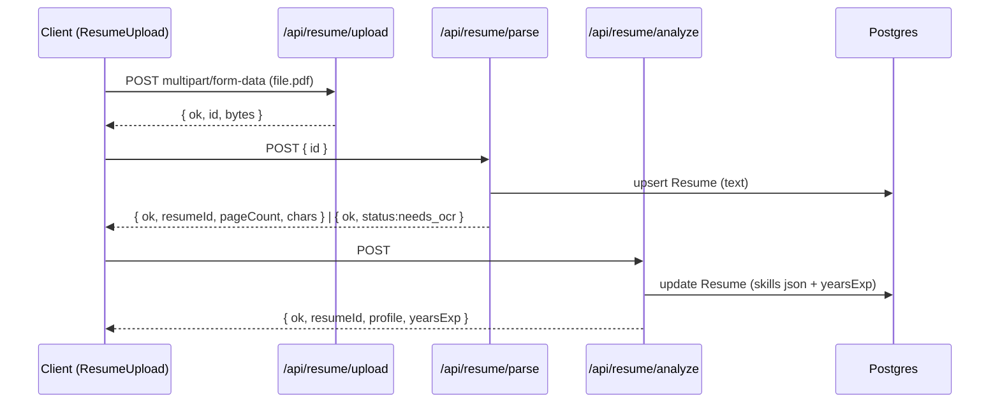
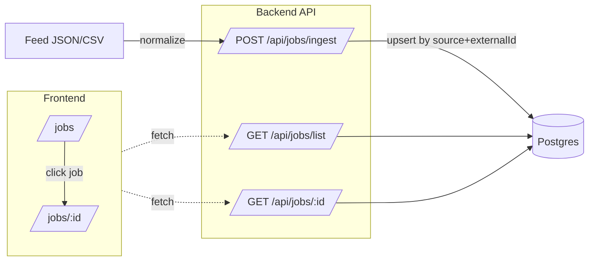

# Job AI App — README (Stage 10)

> גרסת README מותאמת ל-GitHub (Markdown + Mermaid) המציגה את שתי הזרימות המרכזיות:
> **Resume:** Upload → Parse → Analyze
> **Jobs:** Ingest → List → Detail
> כולל API, התקנה, משתני סביבה, מבנה תיקיות וצ’קליסט התקדמות.

---

## 🔭 סקירה כללית

האפליקציה מטפלת בשני צירים:

1. **קורות חיים (Resume)**
   העלאת PDF → שמירה זמנית (TMP) → חילוץ טקסט (Parse) → ניתוח AI ל-JSON מובנה → שמירה והצגה ב-UI.

2. **משרות (Jobs)**
   Ingest מפיד מדומה (ובהמשך מקורות אמיתיים) עם **נורמליזציה** ואיחוד שדות → List API עם פילטרים ודפדוף → דף פרטי משרה.

---

## 📈 תרשימי זרימה

### קורות חיים — רצף (Upload → Parse → Analyze)



### משרות — Ingest → List → Detail



---

## 🧱 סכמת נתונים (Prisma)

### Resume (Stage 9)

* `text: String` — טקסט מלא מה-PDF
* `skills: Json` — אובייקט מובנה מה-AI `{ skills[], tools[], dbs[], years, highlights[] }`
* `yearsExp: Int?` — עיגול/נרמול של years
* `userId: String @unique` — **רשומה אחת לכל משתמש**
* `updatedAt @updatedAt`

### Job (Stage 10 — עדכונים חשובים)

* `source: String` — מזהה מקור (למשל mockA/mockB/…)
* `externalId: String` — מזהה חיצוני ייחודי בתוך המקור
* `title: String`, `company: String`, `location: String?`, `description: String`, `url: String?`
* `skillsRequired: String[]` — **מערך מחרוזות (lowercase)** לנורמליזציה/פילטור יעיל
* `createdAt: DateTime @default(now())`
* אינדקסים/ייחודיות:

  * `@@unique([source, externalId])` — מניעת כפילויות בין מקורות
  * `@@index([createdAt])` — מיון אחרון-קודם מהיר

> מודלים נוספים קיימים: NextAuth (User/Account/Session/VerificationToken) + Match, ApplicationDraft (לשלבים הבאים).

---

## 🔐 אימות גלובלי

`lib/auth.ts` מספק `authOptions`, `auth()`, `requireUser()`, ו-`withUser(handler)`.

דוגמה (NextAuth API):

```ts
// app/api/auth/[...nextauth]/route.ts
import NextAuth from "next-auth";
import { authOptions } from "@/lib/auth";
const handler = NextAuth(authOptions);
export { handler as GET, handler as POST };
```

> ה-ingest מוגן ע"י `withUser` (דרושה התחברות). ה-list/detail ציבוריים לקריאה.

---

## 🧪 API

### 1) `POST /api/resume/upload`

* **קלט:** `multipart/form-data` → שדה `file` (PDF ≤ 5MB)
* **ולידציה:** סיומת `.pdf`, חתימת `%PDF`
* **פעולה:** שמירה זמנית ל-TMP (`resume-<id>.pdf`)
* **פלט:** `200 { ok, id, bytes }`

```bash
curl -X POST \
  -F "file=@/path/to/resume.pdf;type=application/pdf" \
  http://localhost:3000/api/resume/upload
```

### 2) `POST /api/resume/parse`

* **קלט:** JSON `{ id }`
* **פעולה:** קריאת PDF זמני → `pdf-parse` → שמירה ל-DB (`upsert` לפי `userId`)
* **פלט:**

  * `200 { ok, resumeId, pageCount, chars }`
  * או `200 { ok, id, status:"needs_ocr", pageCount }`

```bash
curl -X POST -H "Content-Type: application/json" \
  -d '{"id":"<tmp-id>"}' http://localhost:3000/api/resume/parse
```

### 3) `POST /api/resume/analyze`

* **קלט:** ללא גוף (מבוסס על `Resume.text` של המשתמש)
* **פעולה:** קריאה ל-OpenAI עם JSON Schema strict
* **פלט:** `200 { ok, resumeId, profile, yearsExp }`

דוגמת פלט:

```json
{
  "profile": {
    "skills": ["typescript","react","next.js"],
    "tools": ["git","docker"],
    "dbs": ["postgres","mongodb"],
    "years": 2.5,
    "highlights": ["built full-stack features", "optimized queries"]
  }
}
```

---

### 4) `POST /api/jobs/ingest`  *(Stage 10)*

* **קלט:** (dev) משתמש בפיד דמה (`data/jobs-feed.json`)
* **פעולה:**

  * **נורמליזציה** לשדות אחידים (טיפול בכתיב/רווחים/רישיות, המרת skills ל-lowercase ודילול כפילויות)
  * **upsert** לפי `(source, externalId)` (**אידמפוטנטי**)
* **פלט:** `200 { ok, total, created, updated, skipped }`
* **אבטחה:** דורש התחברות (`withUser`)

```bash
curl -X POST http://localhost:3000/api/jobs/ingest
```

### 5) `GET /api/jobs/list`  *(Stage 10)*

* **פרמטרים:**

  * `q` — חיפוש חופשי ב-`title/company/location/description` (case-insensitive)
  * `location` — פילטר מיקום (`contains`)
  * `skill` — פילטר לפי סקיל מתוך `skillsRequired` (lowercase)
  * `page` (ברירת מחדל 1), `pageSize` (ברירת מחדל 20, מקס' 50)
* **פלט:**
  `200 { ok, total, page, pageSize, items: [{ id, title, company, location, skillsRequired, url, createdAt }] }`

דוגמאות:

```bash
# כל המשרות (דף 1)
curl "http://localhost:3000/api/jobs/list"

# חיפוש חופשי
curl "http://localhost:3000/api/jobs/list?q=engineer"

# פילטר מיקום
curl "http://localhost:3000/api/jobs/list?location=tel%20aviv"

# פילטר סקיל (שמור lowercase)
curl "http://localhost:3000/api/jobs/list?skill=react"

# עמוד 2, גודל 10
curl "http://localhost:3000/api/jobs/list?page=2&pageSize=10"
```

### 6) `GET /api/jobs/[id]`  *(Stage 10)*

* **קלט:** `id` כמקטע URL
* **פעולה:** שליפת משרה
* **פלט:** `200 { ok, job:{ ... } }` או `404 { error:"not found" }`

---

## 🖥️ UI

### ResumeUpload (Stage 9)

* שלבים: `uploading → parsing → analyzing → done/error`
* אוטומציה מלאה: לאחר Upload קורא ל-Parse; אם תקין—ממשיך ל-Analyze; מציג את הפרופיל המובנה.

### Jobs (Stage 10)

* **`/jobs`** — עמוד רשימת המשרות:
  פילטרים (`q / location / skill`), דפדוף (`page/pageSize`), טעינה מ-`/api/jobs/list`, כרטיס לכל משרה עם תגיות skills וקישור חיצוני (אם קיים). לחיצה על **כותרת המשרה** → ניווט לדף פרטים.
* **`/jobs/[id]`** — דף פרטי משרה:
  שליפה ישירה מ-DB (Server Component), מציג מקור, `externalId`, תיאור ו-skills, וקישור חיצוני למשרה (אם קיים).

---

## ⚙️ התקנה והפעלה

דרישות: **Node 18+**, **PostgreSQL**

```bash
npm i
npx prisma migrate dev && npx prisma generate
npm run dev
```

### משתני סביבה

```env
DATABASE_URL=postgres://...
NEXTAUTH_URL=http://localhost:3000
NEXTAUTH_SECRET=...
GITHUB_ID=...
GITHUB_SECRET=...
OPENAI_API_KEY=sk-...   # שרת בלבד
```

> **חשוב:** אל תדחוף `.env/.env.local` לריפו. שמור טמפלייט נקי ב-`.env.local.example`.

---

## 📁 מבנה תיקיות (עיקרי)

```
app/
  api/
    auth/[...nextauth]/route.ts
    resume/
      upload/route.ts
      parse/route.ts
      analyze/route.ts
    jobs/
      ingest/route.ts        # Stage 10
      list/route.ts          # Stage 10
      [id]/route.ts          # Stage 10
  jobs/
    page.tsx                 # Stage 10 (UI רשימה + פילטרים)
    [id]/page.tsx            # Stage 10 (UI פרטים)

components/
  ResumeUpload.tsx
  JobsFilters.tsx            # Stage 10

lib/
  auth.ts
  db.ts
  jobs/                      # Stage 10 (normalizers)

data/
  jobs-feed.json             # Stage 10 (פיד דמה)

prisma/
  schema.prisma
  migrations/

types/
  pdf-parse.d.ts
```

---

## 🧰 תקלות ופתרונות מהירים

* **`/jobs` ריק** → כנראה לא הרצתי ingest.
  הרץ `POST /api/jobs/ingest` (כשאתה מחובר). לאחר מכן `/jobs` יציג הכל.
* **פילטר `skill` לא מחזיר תוצאות** → ודא שהפרמטר lowercase (למשל `react`).
* **401 ב-`/api/jobs/ingest`** → דרושה התחברות (NextAuth).
* **פרפורמנס חיפוש חופשי** → לנתונים קטנים זה בסדר. בהמשך: pg\_trgm/FTS.
* **pdf-parse ENOENT** → ייבוא מ-subpath: `pdf-parse/lib/pdf-parse.js`.
* **אין שכבת טקסט ב-PDF** → `needs_ocr` (שלב OCR עתידי).

---

## ✅ צ’קליסט Stage 10

* [x] נורמליזציית פיד משרות לאחידות שדות
* [x] `upsert` לפי `(source, externalId)` — אידמפוטנטי
* [x] שינוי `Job.skillsRequired` ל-`String[]` (lowercase)
* [x] `GET /api/jobs/list` עם פילטרים + דפדוף
* [x] `/jobs` — UI רשימה עם פילטרים/דפדוף
* [x] `GET /api/jobs/[id]` + `/jobs/[id]` — דף פרטי משרה

---

## 🔜 המשך דרך

* **Stage 11:** מנוע התאמה (Match Engine v1) — ציון לפי כיסוי סקילז + “סיבות” (הסברים)
* **Stage 11.1:** הוספת ניסיון/מיקום לשקלול
* OCR ל-PDF סרוקים (Tesseract/Cloud Vision)
* Queue/Worker ל-PDF כבדים
* Ajv Validation ל-Schema בצד שרת
* דשבורד להצגת פרופיל ושיפור הפרומפט

---

**License:** MIT
**Author:** itay — Job AI App
