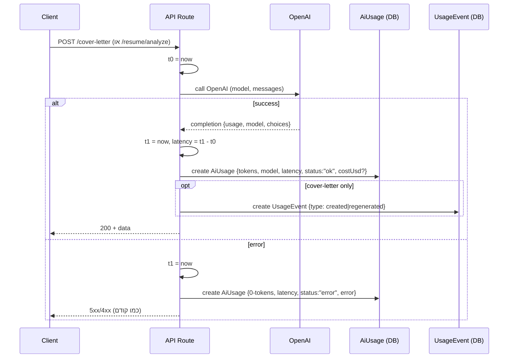
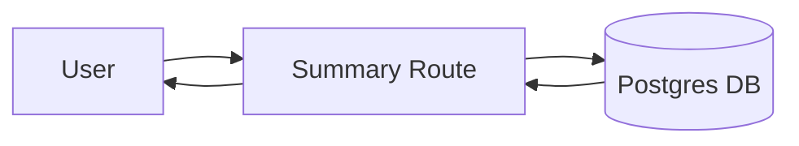

להדבקה ישירה ב-GitHub👇

---

# Job AI App — README (Stage 15)

> גרסת README מותאמת ל-GitHub (Markdown + Mermaid).
>
> זרימות מרכזיות:
>
> * **Resume:** Upload → Parse → Analyze
> * **Jobs:** Ingest → List → Detail
> * **Match (Stage 11):** Job Detail → Compute Match → Persist → Show
> * **Cover Letter (Stage 12):** Job Detail → Generate (AI) / Edit → Save Draft
> * **UI/UX Polish (Stage 13):** Loading/Skeletons, Filter Chips + Clear All, Debounced Search, Match Badge, Navbar Menu, Resume Upload UX
> * **Security (Stage 14):** Rate limiting, Zod validation, AuthN review
> * **Logs & Metrics (Stage 15):** לוג טוקנים/Latency/עלות ל-AI, ספירת אירועי מכתב, API סיכום, דשבורד `/metrics`

---

## 🔭 סקירה כללית

ב-**Stage 15** הוספנו תצפיות (Observability) כדי להבין **שימוש ועלויות**:

* **לוג שימוש ב-AI (OpenAI):**

  * מודל, טוקנים (`prompt/completion/total`), זמן תגובה (ms), סטטוס (`ok`/`error`), ושגיאה מקוצרת.
  * חישוב **עלות משוערת** (אם הוגדר מחירון במשתנה סביבה).
* **אירועי מוצר (Usage Events):**

  * `cover_letter_created` / `cover_letter_regenerated` — לספירת יצירה/רג'נרציה.
* **API סיכום:** `GET /api/metrics/summary?days=N`
* **דשבורד:** `/metrics` (Server Component) — KPI Cards תואמי UI קיים.

> 💡 למה למדוד כבר עכשיו? כדי לזהות מוקדם “כיסים יקרים” (מודלים/זרימות), להבין אימפקט של פיצ'רים, ולהצדיק אופטימיזציה לפני התרחבות שימוש.

---

## 📈 תרשימי זרימה

### אינסטרומנטציה סביב קריאת AI (Cover Letter / Analyze)



### API סיכום מדדים



---

## 🧱 סכמת נתונים (Prisma) — Stage 15

נוספו שני מודלים:

* **`AiUsage`** — לוג שימוש ב-AI
  שדות עיקריים: `endpoint`, `method`, `model`, `promptTokens`, `completionTokens`, `totalTokens`, `latencyMs`, `status`, `error?`, `costUsd?`, `userId?`, `createdAt`.
  אינדקסים: `@@index([createdAt])`, `@@index([userId, createdAt])`.

* **`UsageEvent`** — אירועי מוצר
  שדות עיקריים: `type` (`cover_letter_created`/`cover_letter_regenerated`/...), `refId?`, `meta?`, `userId?`, `createdAt`.
  אינדקסים: `@@index([type, createdAt])`, `@@index([userId, createdAt])`.

> שאר המודלים (User/Account/Session/Resume/Job/Match/ApplicationDraft) ללא שינוי.

---

## 🔐 אימות והרשאות

* **עם `withUser`**:

  * `POST /api/resume/analyze`
  * `GET/POST/PUT /api/jobs/:id/cover-letter`
  * `POST /api/jobs/ingest`
  * `GET /api/metrics/summary?days=N` (סיכום **למשתמש הנוכחי** בלבד)

* ציבורי:

  * `GET /api/jobs/list`
  * `GET /api/jobs/:id`

> Rate Limit ו-Zod מ-Stage 14 נשארו פעילים.

---

## 🧪 API

### חדש (Stage 15)

#### 1) `GET /api/metrics/summary?days=N` *(מוגן)*

סיכום שימוש ל-N הימים האחרונים (ברירת מחדל `7`):

```json
{
  "ok": true,
  "range": { "days": 7, "from": "2025-09-01T…", "to": "2025-09-08T…" },
  "ai": {
    "calls": 12,
    "promptTokens": 3456,
    "completionTokens": 2100,
    "totalTokens": 5556,
    "avgLatencyMs": 812,
    "costUsd": 0.97
  },
  "coverLetters": { "created": 3, "regenerated": 4, "total": 7 }
}
```

**דוגמה (דפדפן, מחובר):**

```js
fetch("/api/metrics/summary?days=14").then(r=>r.json()).then(console.log)
```

### מעודכן (Stage 15 – אינסטרומנטציה)

* `POST /api/jobs/:id/cover-letter` — לוג AI + אירוע `created/regenerated`.
* `POST /api/resume/analyze` — לוג AI.

> ההתנהגות העסקית לא השתנתה; רק לוגים/מדדים מתווספים.

---

## 🖥️ UI

### חדש: `/metrics`

דף KPI Cards תואם ל-UI של האפליקציה (אותה מעטפת `max-w-5xl`, כותרת, כרטיסים “ידניים”). מציג:

* **AI Usage:** Calls, Tokens (Prompt/Completion/Total), Avg Latency, Cost.
* **Cover Letters:** Created/Regenerated/Total.
* **Quick Link:** קישור ל-Raw JSON של ה-API.

בורר טווח ימים דרך query string: `?days=7|14|30`.

---

## ⚙️ התקנה והפעלה

דרישות: **Node 18+**, **PostgreSQL**

```bash
npm i
npx prisma migrate dev && npx prisma generate
npm run dev
```

### משתני סביבה

```env
DATABASE_URL=postgres://...
NEXTAUTH_URL=http://localhost:3000
NEXTAUTH_SECRET=...
GITHUB_ID=...
GITHUB_SECRET=...
OPENAI_API_KEY=sk-...   # נדרש ל-Analyze/Cover Letter (שרת בלבד)

# אופציונלי — חישוב עלות (USD) לפי 1K טוקנים (input/output) לכל prefix של מודל
# דוגמה לגילום gpt-4o-mini:
OPENAI_PRICE_PER_1K_JSON={"gpt-4o-mini":{"input":0.15,"output":0.60}}
```

> אם לא תגדיר מחירון — `costUsd` יחזור `null` וזה תקין.

---

## 📁 מבנה תיקיות (מעודכן ל-Stage 15)

```
app/
  layout.tsx
  providers.tsx
  metrics/
    page.tsx                          # Stage 15: דשבורד
  api/
    resume/
      upload/route.ts
      parse/route.ts
      analyze/route.ts                # Stage 15: לוג AI
    jobs/
      ingest/route.ts
      list/route.ts                   # Stage 14: Zod
      [id]/
        route.ts
        match/route.ts                # Stage 14: Rate limit
        cover-letter/route.ts         # Stage 14+15: Rate limit + Zod + לוג AI + אירועים
    metrics/
      summary/route.ts                # Stage 15: API סיכום

components/
  Navbar.tsx
  ResumeUpload.tsx
  JobsFilters.tsx
  FilterChips.tsx
  EmptyState.tsx
  ErrorState.tsx
  MatchBadge.tsx
  CoverLetterEditor.tsx
  ui/
    button.tsx
    skeleton.tsx

lib/
  auth.ts
  db.ts
  security/
    rateLimit.ts                      # Stage 14
  validation/
    jobs.ts                           # Stage 14
    coverLetter.ts                    # Stage 14
  cover-letter/
    prompt.ts
  match/
    engine.ts
  metrics.ts                          # Stage 15: estimateOpenAiCost, logAiUsage, logEvent

hooks/
  useDebounce.ts

prisma/
  schema.prisma                       # Stage 15: AiUsage, UsageEvent
  migrations/
```

---

## 🧰 תקלות ופתרונות מהירים

* **אין `costUsd`** — לא הוגדר `OPENAI_PRICE_PER_1K_JSON`. הגדר לפי המודלים בשימוש (התאמה לפי prefix).
* **שגיאות טיפוסי Prisma (דלגייט לא מזוהה)** — הרץ `prisma generate`, נקה קאש TypeScript/VS Code, ודא שאין כפילויות `@prisma/client`.
* **429 ב-cover-letter** — נובע מ-Rate Limit משלב 14. המתן לפי `Retry-After` או הרץ לאט יותר.
* **Analyze נכשל עם JSON** — ודא שה-resume כולל טקסט וש-OpenAI מחזיר `response_format: json_schema` תואם.

---

## ✅ צ’קליסט Stage 15

* [x] **DB:** נוספו `AiUsage` + `UsageEvent` עם אינדקסים.
* [x] **Instrumentation:** `POST /api/jobs/:id/cover-letter` (לוג AI + אירועים), `POST /api/resume/analyze` (לוג AI).
* [x] **API Summary:** `GET /api/metrics/summary?days=N`.
* [x] **UI:** עמוד `/metrics` (KPI Cards).
* [x] **Smoke Tests:** רישום רשומות ל-AiUsage/UsageEvent + התאמה מול הדשבורד.
* [x] **Git:** קומיטים נקיים, ללא `.env`.

---

## 🔜 המשך דרך

* **Breakdown מתקדם:** פילוח לפי endpoint/model + גרף קטן (Recharts).
* **Rate Limit ל-Analyze** (אם נדרש).
* **איסוף 4xx/429**: ספירה ו-dashboards לטעויות משתמש/קצב.
* **Privacy & Retention:** מדיניות שמירת לוגים / אנונימיזציה.

---

**License:** MIT
**Author:** itay — Job AI App
